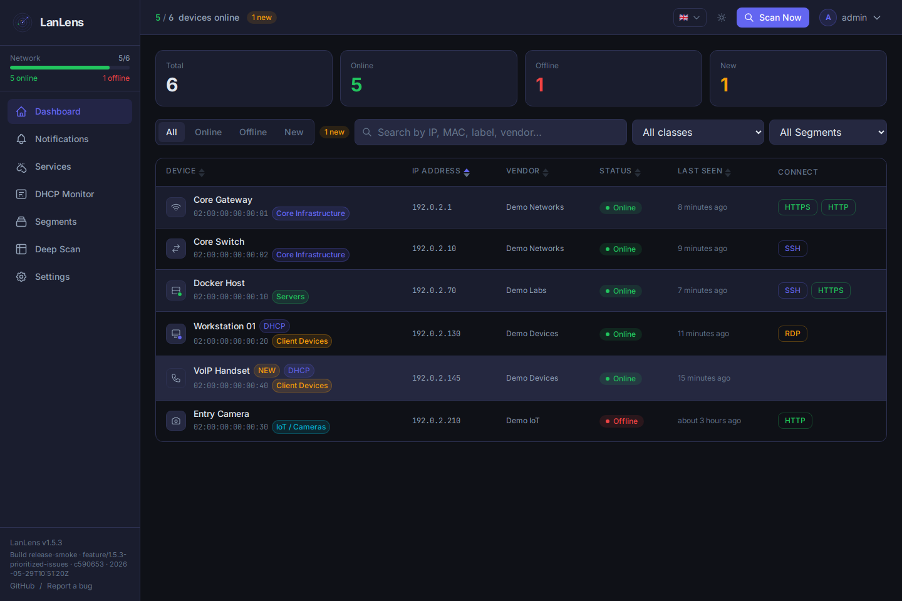
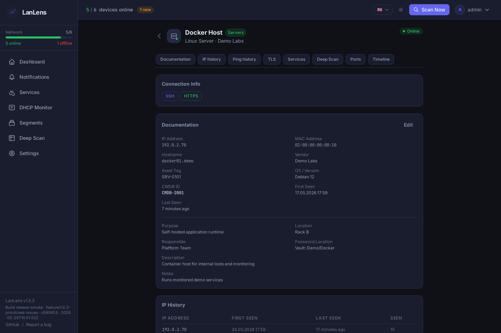
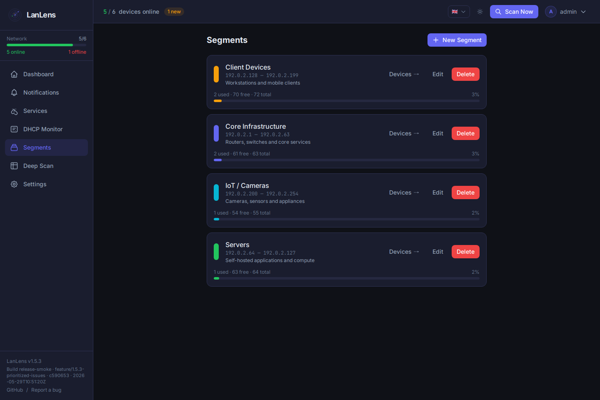
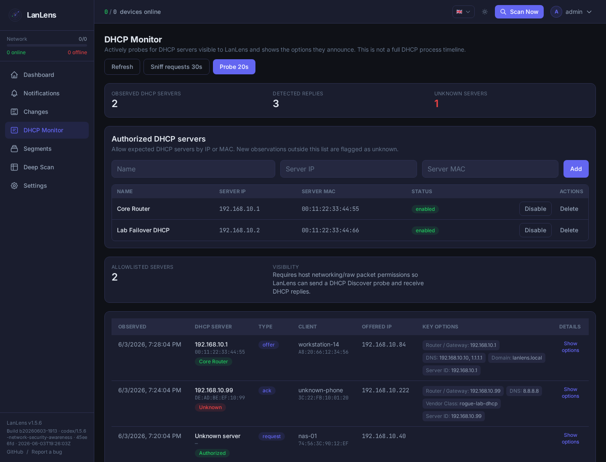
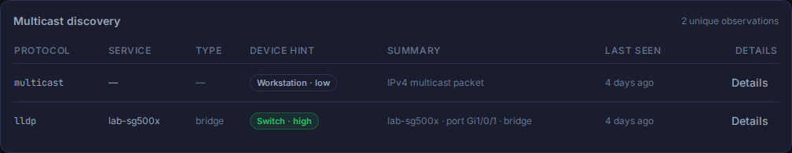
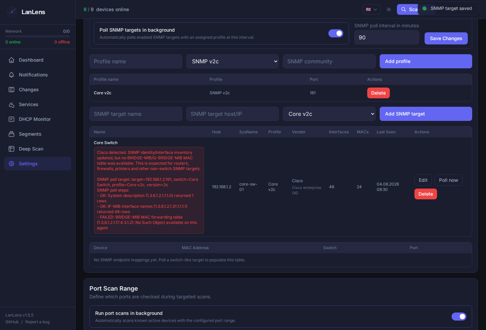
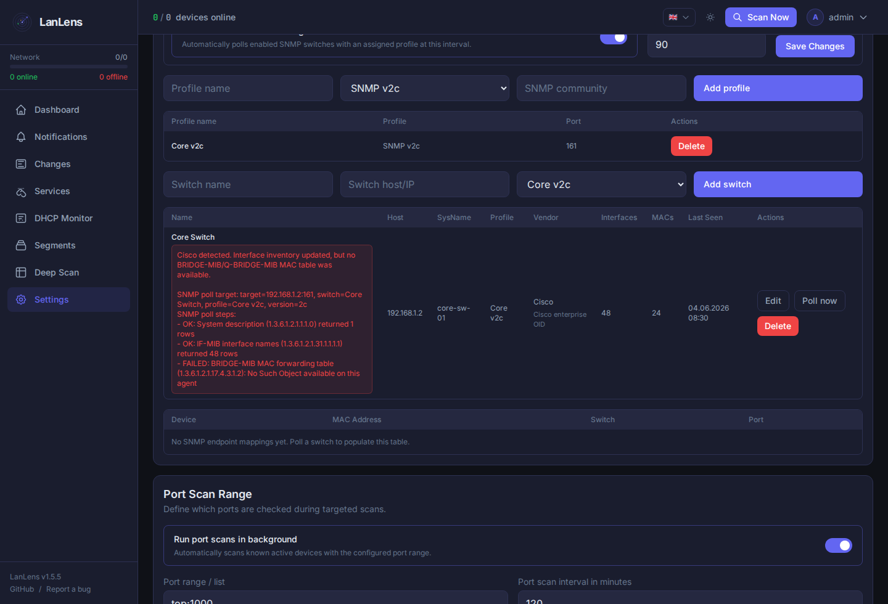
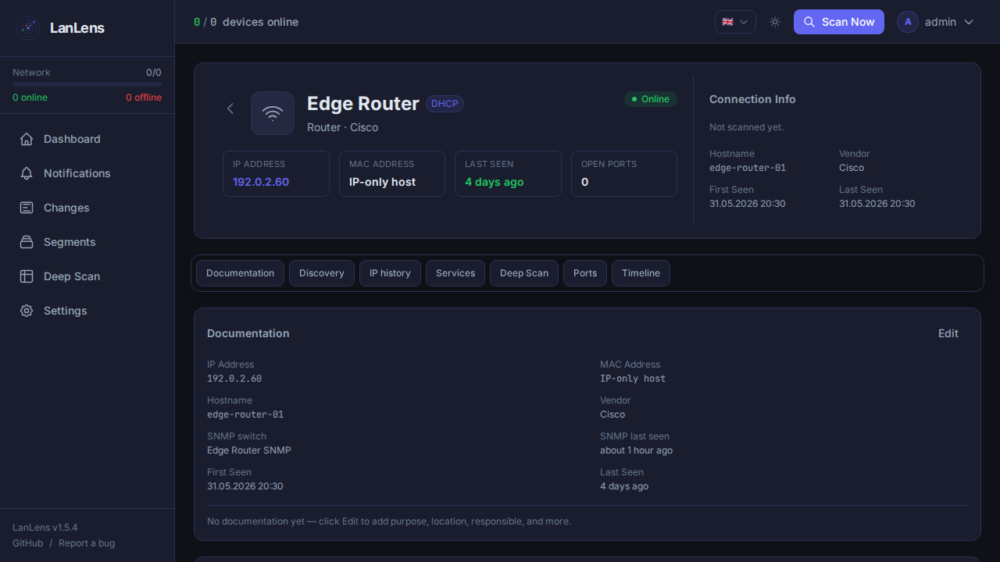
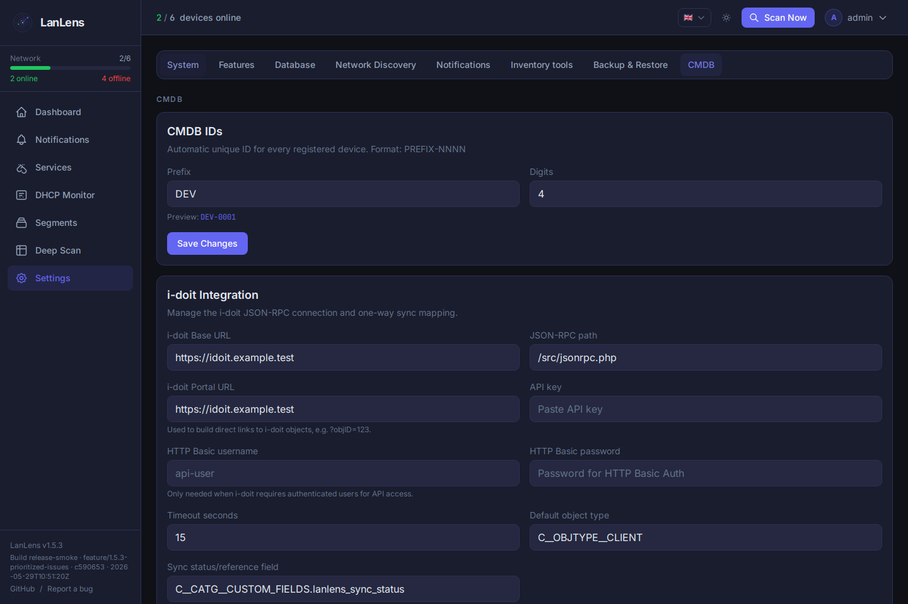
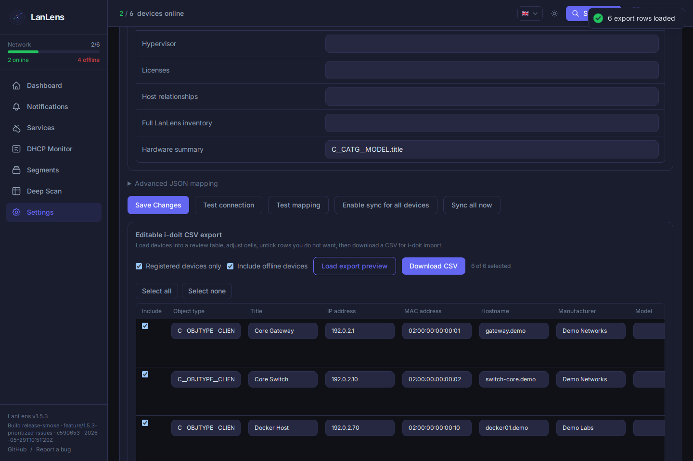

<div align="center">


# LanLens

**Self-hosted network inventory, local network scanner, and documentation dashboard**

[](https://github.com/AlexRosbach/LanLens)
[](LICENSE)
[](https://hub.docker.com/r/alexrosbach/lanlens)
[](https://x.com/itneedtoknow)

LanLens turns a Docker host into a local network scanner that discovers MAC/IP devices, builds a device inventory, and gives operators in home lab, small IT, and enterprise environments a clean web UI for documentation, security awareness, and CMDB/i-doit export workflows.

[Wiki](https://github.com/AlexRosbach/LanLens/wiki) · [Changelog](CHANGELOG.md) · [Docker Hub](https://hub.docker.com/r/alexrosbach/lanlens) · [Website](https://lanlens.org/) · [Legal Notice](https://lanlens.org/privacy.html)

</div>

---

## Your Network at a Glance

LanLens gives you a quick, local view of what is on your network:

- Devices found by MAC/IP device discovery, with vendor hints and online/offline state
- A practical device inventory for names, notes, owners, locations, services, ports, and history
- Segments for routers, switches, servers, IoT, cameras, clients, and unknown devices
- Awareness signals for DHCP, ARP/MAC, LLDP/CDP, STP/RSTP, OSPF, SNMP, and scan-detected changes
- Export paths for CMDB/i-doit workflows when inventory data should leave LanLens

Why people use it:

- **Fast start:** a Docker network scanner for networks from home labs to small IT and enterprise environments.
- **Less spreadsheet work:** turn scan results into a maintained self-hosted network inventory.
- **Local by default:** no cloud account is required, and there is no product telemetry pipeline.

Optional expert views add SNMP switch-port context, passive LLDP/CDP/STP/OSPF discovery hints, services, TLS checks, notifications, and CMDB/i-doit integration when you need them. Credentials are masked in API responses; protect the database volume and backups because configured secrets live there.

> [!IMPORTANT]
> Use LanLens only in networks you own or where you have explicit permission to scan and monitor devices. Network discovery and port scanning can be misused against third-party systems.

---

## Support

LanLens is free and open source. If it helps you or saves you time, you can support ongoing development voluntarily. Support does not buy support priority, features, or access.

<a href="https://www.buymeacoffee.com/alexrosbaci" target="_blank"></a>

Legal notice and project contact information are maintained on [lanlens.org/privacy.html](https://lanlens.org/privacy.html).

---

## Star History

<a href="https://www.star-history.com/?repos=AlexRosbach%2FLanLens&type=date&legend=top-left">
 <picture>
 <source media="(prefers-color-scheme: dark)" srcset="https://api.star-history.com/chart?repos=AlexRosbach/LanLens&type=date&theme=dark&legend=top-left" />
 <source media="(prefers-color-scheme: light)" srcset="https://api.star-history.com/chart?repos=AlexRosbach/LanLens&type=date&legend=top-left" />
 
 </picture>
</a>

---

## Product Screenshots

The screenshots below use sanitized demo data with documentation IP ranges and example names.

| Dashboard | Device detail |
|---|---|
|  |  |

| Segments | DHCP security awareness |
|---|---|
|  |  |

| LLDP/CDP class hints | SNMP targets |
|---|---|
|  |  |

| SNMP poll diagnostics | Device linked to SNMP identity |
|---|---|
|  |  |

| CMDB / i-doit settings | Reviewed i-doit CSV export |
|---|---|
|  |  |

---

## Quick Start

### Requirements

- Docker 20.10+
- Docker Compose v2
- Linux host recommended for direct ARP scanning

### 1. Start LanLens

```bash
curl -fsSL https://raw.githubusercontent.com/AlexRosbach/LanLens/main/docker-compose.yml -o docker-compose.yml && docker compose up -d
```

On first startup, LanLens generates a strong `SECRET_KEY` inside the persistent `lanlens_data` Docker volume.

Open:

```text
http://<your-host-ip>:7765
```

Default first-run credentials:

```text
admin / admin
```

LanLens forces a password change after the first login. For full MAC/vendor discovery, run it on a Linux host with host networking as shown in the compose file.

---

## Deployment Notes

LanLens uses `network_mode: host` by default because local ARP discovery needs raw network access on the host interface. Bridge mode can serve the UI, but direct ARP/MAC discovery will not work the same way.

Core runtime settings:

| Variable | Default | Purpose |
|---|---|---|
| `SECRET_KEY` | generated on first start | Encryption/signing key; set manually only when restoring/migrating encrypted credentials |
| `DEFAULT_ADMIN_PASSWORD` | `admin` | Initial admin password when no user exists |
| `LANLENS_PORT` | `7765` | HTTP port exposed by nginx |
| `BACKEND_PORT` | `17765` | Internal FastAPI port behind nginx |
| `DB_PATH` | `/data/lanlens.db` | SQLite database path |
| `TZ` | `UTC` | Container timezone |

For HTTPS, external databases, Scan Nodes, deep scan permissions, CMDB/i-doit, SNMP, backups, and troubleshooting, use the [LanLens Wiki](https://github.com/AlexRosbach/LanLens/wiki).

---

## Learn More

- [LanLens Wiki](https://github.com/AlexRosbach/LanLens/wiki): setup, configuration, scanning behavior, integrations, troubleshooting, and common workflows
- [Changelog](CHANGELOG.md): release history and migration notes
- [Security Policy](SECURITY.md): vulnerability reporting and supported versions

---

## Docker Images

Docker images are published at [`alexrosbach/lanlens`](https://hub.docker.com/r/alexrosbach/lanlens). Use the compose file in this repository for the expected host-network deployment model and required environment variables.

Project updates and occasional build notes are posted on [X / @itneedtoknow](https://x.com/itneedtoknow).

---

## Development

Backend:

```bash
python3 -m venv .venv
source .venv/bin/activate
pip install -r backend/requirements.txt

export SECRET_KEY=dev-secret-key-at-least-32-chars-long
export DB_PATH=./data/lanlens.db
mkdir -p data

python backend/cli/init_db.py
python backend/cli/init_admin.py
uvicorn backend.main:app --reload --port 8000
```

Frontend:

```bash
cd frontend
npm install
npm run dev
```

---

## License

MIT License, see [LICENSE](LICENSE).

Dependency note: LanLens uses GPL/LGPL and dual-licensed libraries for network discovery and remote connectivity features. See [THIRD_PARTY_NOTICES.md](THIRD_PARTY_NOTICES.md) before redistributing bundled builds or Docker images.
