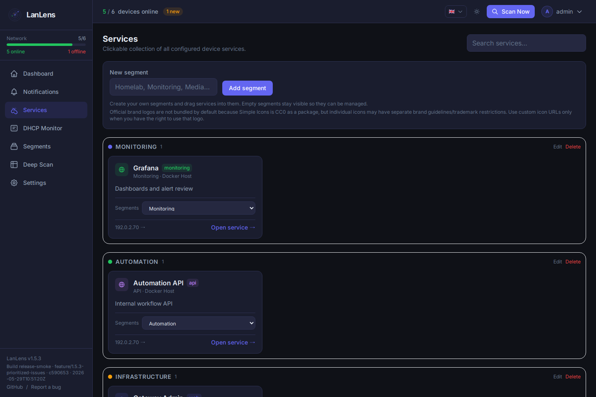
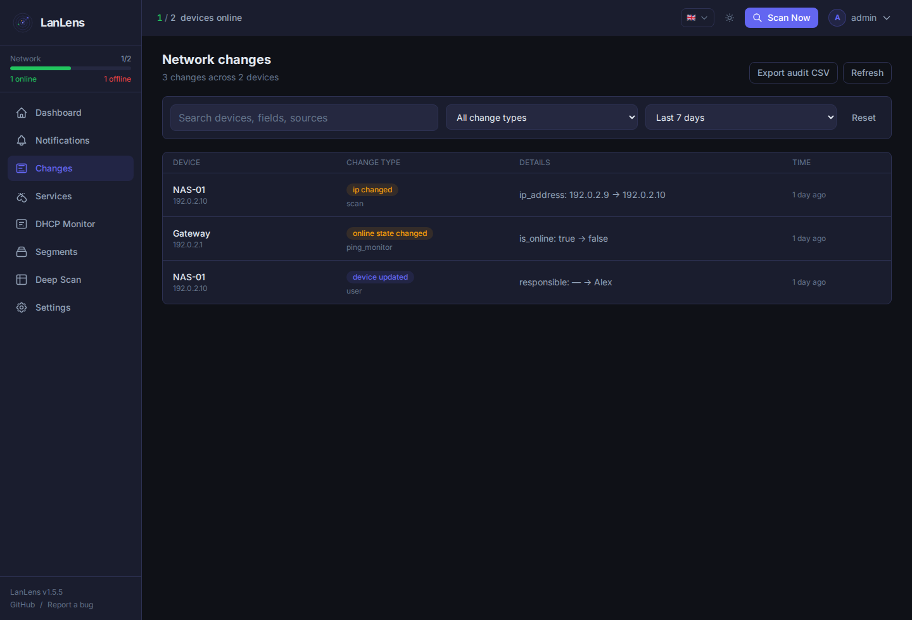
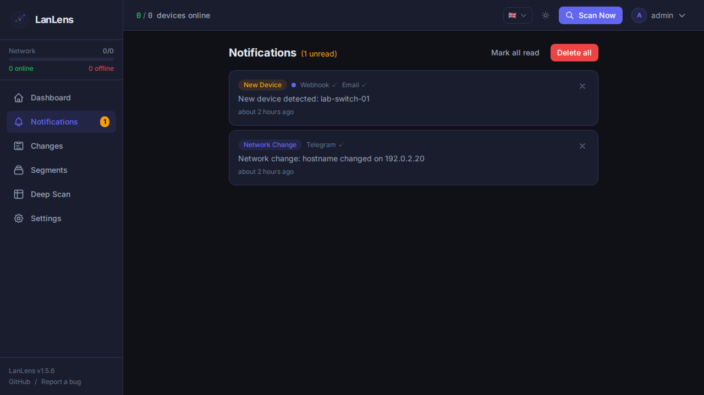
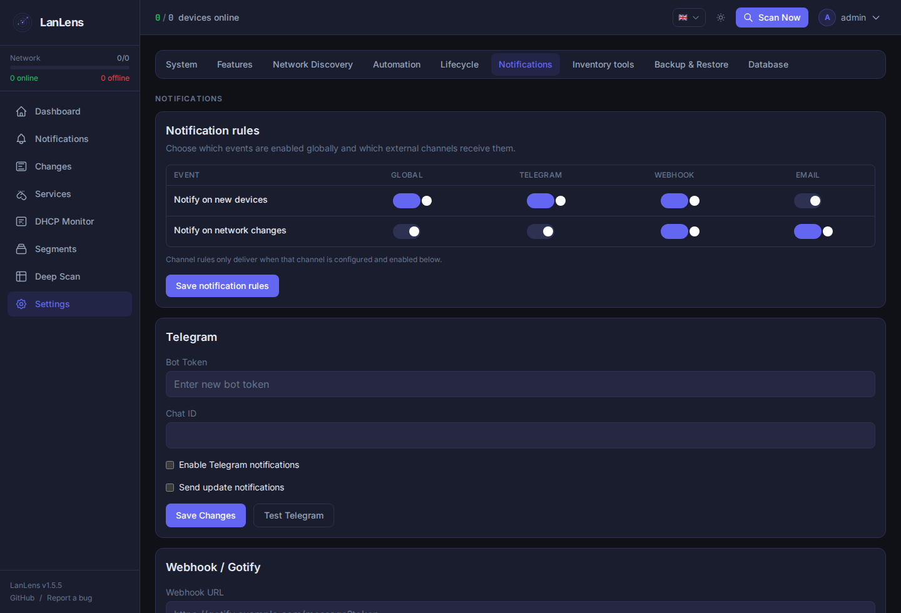
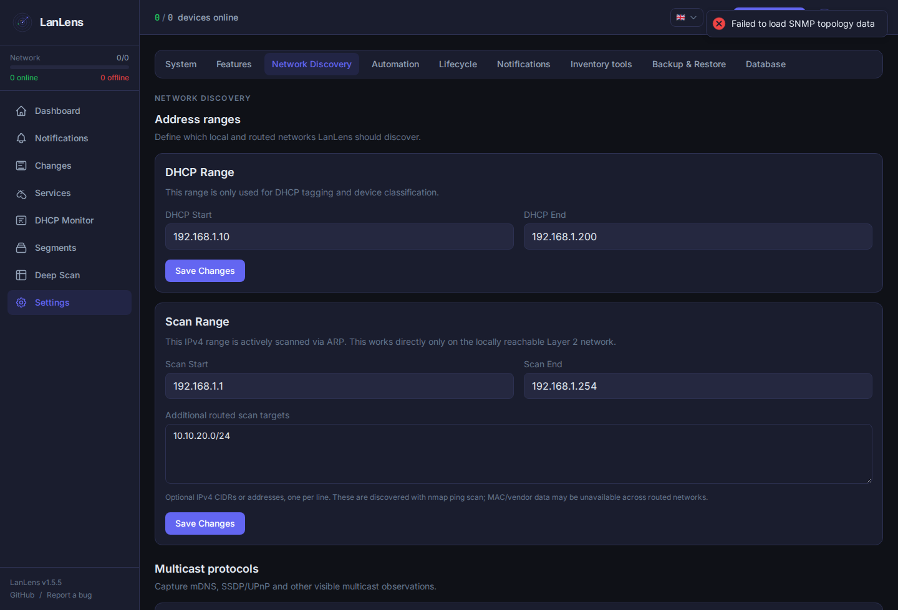
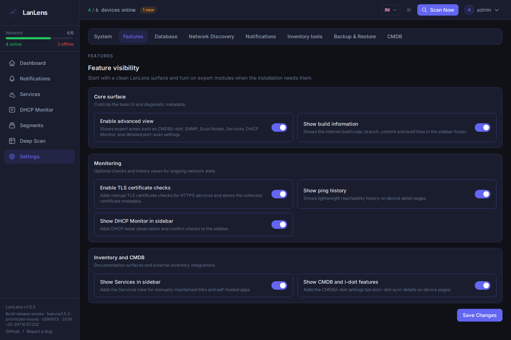

<div align="center">


# LanLens

**Self-hosted network monitoring and documentation dashboard**

[](https://github.com/AlexRosbach/LanLens)
[](LICENSE)
[](https://hub.docker.com/r/alexrosbach/lanlens)
[](https://x.com/itneedtoknow)

LanLens scans your local network, identifies devices by MAC/IP, and gives you a clean web UI to document, classify, monitor, and connect to them.

[Documentation](docs/documentation.md) · [Knowledge Base](docs/knowledgebase.md) · [Changelog](CHANGELOG.md) · [Docker Hub](https://hub.docker.com/r/alexrosbach/lanlens)

</div>

---

## What LanLens Does

LanLens is built for small self-hosted, homelab, and lightweight IT environments where you want network discovery plus practical documentation without a full enterprise discovery suite.

- Discover devices on the local Layer-2 network with ARP scanning
- Track online/offline state, DHCP range membership, IP history, and open services
- Flag unknown DHCP servers, ARP/MAC drift, and VRRP/HSRP control-plane peers for network security awareness
- Capture optional mDNS, SSDP/UPnP, and multicast observations on an adjustable interval and duration
- Schedule optional background port scans with configurable interval and port range
- Route notification events through global master rules plus per-channel Telegram, webhook/Gotify, and email overrides
- Review and export a network change log with before/after values for device discoveries, state changes, IP moves, hostname changes, archive actions, and manual documentation edits
- Archive inactive unregistered discoveries automatically and keep them in a dedicated archived view
- Document devices with owner, location, purpose, OS, asset tag, notes, and CMDB ID
- Group networks into segments and keep device lists readable
- Connect quickly through SSH, RDP, HTTP, and HTTPS shortcuts
- Enable optional expert modules only when needed through **Settings → Features**
- Manage SNMP targets and switch topology, including editable target name, host, profile, enabled state, optional background poll interval, detailed poll diagnostics, non-switch SNMP identity scans, IP-scan device classification, real-port filtering, interface statistics, and device-detail linkage by assignment or IP match
- Maintain a clickable Services directory for self-hosted apps and device services
- Enrich selected devices through SSH/WinRM deep scans
- Prepare CMDB/i-doit exports and sync workflows, including reviewed CSV export
- Route new-device and network-change notifications through global event rules plus per-channel Telegram, webhook/Gotify, and email rules, with bulk cleanup for in-app notifications

> [!IMPORTANT]
> Use LanLens only in networks you own or where you have explicit permission to scan and monitor devices. Network discovery and port scanning can be misused against third-party systems.

---

## Screenshots

The screenshots below use sanitized demo data with documentation IP ranges and example names.

| Dashboard | Device detail |
|---|---|
|  |  |

| Segments | Services directory |
|---|---|
|  |  |

| Network changes |
|---|
|  |

| Notifications cleanup |
|---|
|  |

| Notification rules |
|---|
|  |

| Multicast capture settings |
|---|
|  |

| Feature visibility |
|---|
|  |

Feature switches hide optional expert modules and enforce the same state in the backend, including related authenticated APIs and background jobs.

| CMDB / i-doit settings | Editable i-doit CSV export |
|---|---|
|  |  |

| SNMP switch port visualization |
|---|
|  |

| SNMP interface-only switch view |
|---|
|  |

---

## Quick Start

### Requirements

- Docker 20.10+
- Docker Compose v2
- Linux host recommended for direct ARP scanning

### 1. Download the compose file

```bash
curl -O https://raw.githubusercontent.com/AlexRosbach/LanLens/main/docker-compose.yml
```

### 2. Generate a secret key

```bash
python3 -c "import secrets; print(secrets.token_hex(32))"
```

Replace `CHANGE_THIS_TO_A_LONG_RANDOM_STRING` in `docker-compose.yml` with the generated value.

### 3. Start LanLens

```bash
docker compose up -d
```

Open:

```text
http://<your-host-ip>:7765
```

Default first-run credentials:

```text
admin / admin
```

LanLens forces a password change after the first login.

---

## Deployment Notes

LanLens uses `network_mode: host` by default because local ARP discovery needs raw network access on the host interface. Bridge mode can serve the UI, but direct ARP/MAC discovery will not work the same way.

Core runtime settings:

| Variable | Default | Purpose |
|---|---|---|
| `SECRET_KEY` | required | Encryption/signing key; set a strong random value |
| `DEFAULT_ADMIN_PASSWORD` | `admin` | Initial admin password when no user exists |
| `LANLENS_PORT` | `7765` | HTTP port exposed by nginx |
| `BACKEND_PORT` | `17765` | Internal FastAPI port behind nginx |
| `DB_PATH` | `/data/lanlens.db` | SQLite database path |
| `TZ` | `UTC` | Container timezone |

For HTTPS, external databases, Scan Nodes, deep scan permissions, CMDB/i-doit, SNMP, backups, and troubleshooting, use the [technical documentation](docs/documentation.md).

---

## Documentation Map

- [Technical documentation](docs/documentation.md): architecture, deployment, configuration, API, scanning behavior, deep scan, CMDB/i-doit, SNMP, external databases, and development notes
- [Knowledge Base / FAQ](docs/knowledgebase.md): common setup errors, scanning behavior, i-doit/CMDB troubleshooting, and Scan Node notes
- [Changelog](CHANGELOG.md): release history and migration notes
- [Security Policy](SECURITY.md): vulnerability reporting and supported versions

---

## Releases

Docker images are published at [`alexrosbach/lanlens`](https://hub.docker.com/r/alexrosbach/lanlens).

```bash
docker pull alexrosbach/lanlens:1.5.6
```

Use release tags for reproducible deployments. `latest` tracks the newest published build.

Project updates, release notes, and occasional build notes are posted on [X / @itneedtoknow](https://x.com/itneedtoknow).

---

## Development

Backend:

```bash
python3 -m venv .venv
source .venv/bin/activate
pip install -r backend/requirements.txt

export SECRET_KEY=dev-secret-key-at-least-32-chars-long
export DB_PATH=./data/lanlens.db
mkdir -p data

python backend/cli/init_db.py
python backend/cli/init_admin.py
uvicorn backend.main:app --reload --port 8000
```

Frontend:

```bash
cd frontend
npm install
npm run dev
```

---

## License

MIT License, see [LICENSE](LICENSE).

Dependency note: LanLens uses GPL/LGPL and dual-licensed libraries for network discovery and remote connectivity features. See [THIRD_PARTY_NOTICES.md](THIRD_PARTY_NOTICES.md) before redistributing bundled builds or Docker images.
