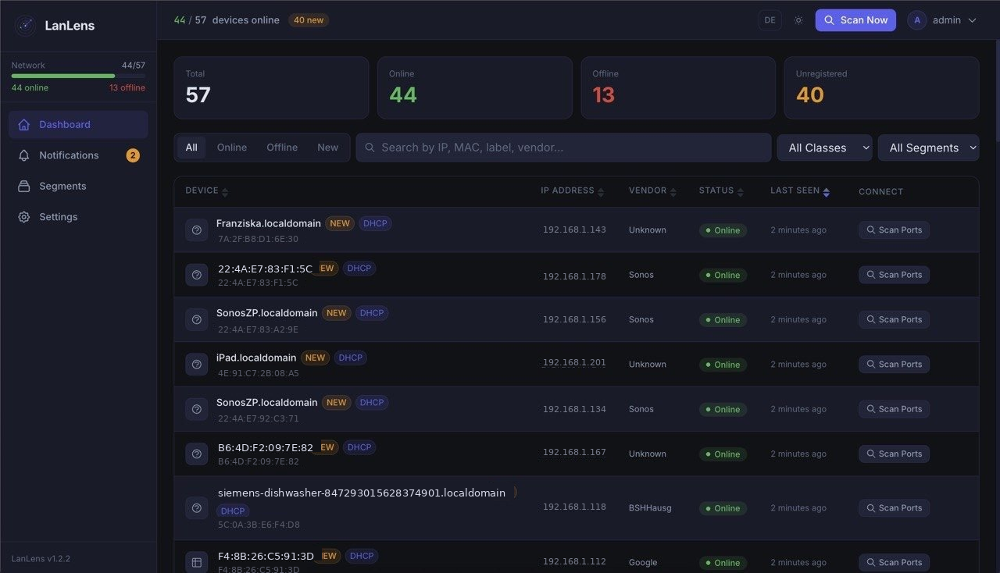
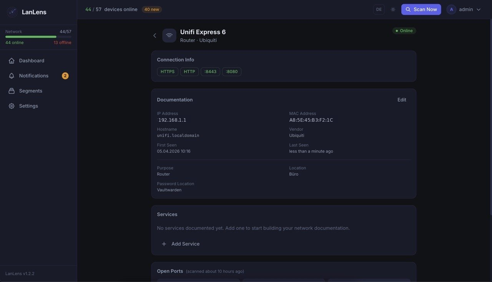
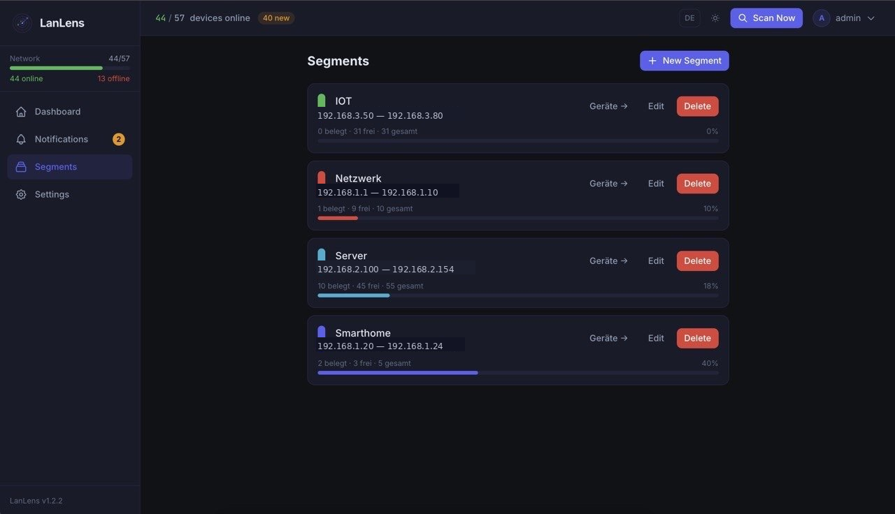
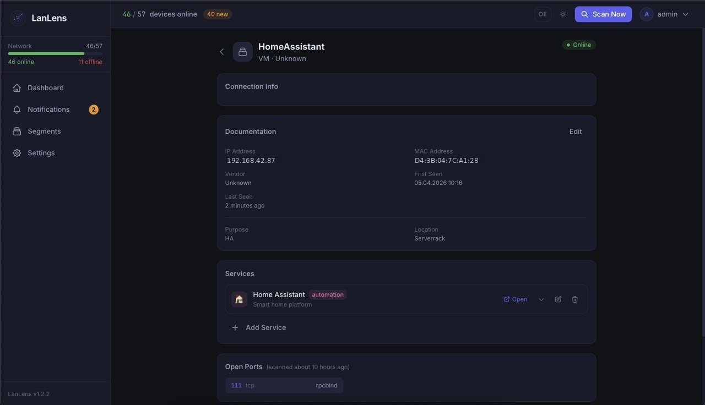

<div align="center">


# LanLens

**Self-hosted network monitoring and documentation dashboard**

[](https://github.com/AlexRosbach/LanLens)
[](LICENSE)
[](https://hub.docker.com/r/alexrosbach/lanlens)

LanLens scans your local network, identifies devices by MAC/IP, and gives you a clean web UI to document, classify, and connect to them.

</div>

---

## Features

- Automatic LAN discovery via ARP scan
- Device classification and offline MAC vendor lookup
- DHCP badge detection
- Segments with colour, range, and IP usage
- Per-device documentation fields
- Service inventory per device
- One-click connect actions (SSH, RDP, HTTP, HTTPS)
- Port scanning via nmap
- Telegram notifications for new devices and updates
- English and German UI
- Responsive dashboard for desktop and mobile

---

## Screenshots

> IP and MAC addresses in the screenshots were anonymized for privacy.

| Dashboard | Device detail |
|---|---|
|  |  |

| Segments | Device documentation |
|---|---|
|  |  |

---

## Quick Start

### Requirements

- Docker 20.10+ with `docker compose`
- Linux host recommended for raw ARP scanning (`network_mode: host`)

### 1. Get the compose file

```bash
curl -O https://raw.githubusercontent.com/AlexRosbach/LanLens/main/docker-compose.yml
```

### 2. Generate a secret key

```bash
python3 -c "import secrets; print(secrets.token_hex(32))"
```

Replace `CHANGE_THIS_TO_A_LONG_RANDOM_STRING` in `docker-compose.yml` with the generated value.

### 3. Start LanLens

```bash
docker compose up -d
```

### 4. Open the UI

Open:

```text
http://<your-host-ip>:7765
```

Default credentials:

```text
admin / admin
```

You will be forced to change the password on first login.

---

## Configuration

### Environment variables

| Variable | Default | Description |
|---|---|---|
| `SECRET_KEY` | — | Required, at least 32 random characters |
| `DEFAULT_ADMIN_PASSWORD` | `admin` | Initial admin password |
| `DB_PATH` | `/data/lanlens.db` | SQLite database path |
| `TZ` | `UTC` | Container timezone |

### Scan range

Set the scan range in **Settings → Network**:
- start IP
- end IP
- scan interval

### Telegram

Configure Telegram in **Settings → Notifications**:
- bot token
- chat ID
- optional test message

---

## Updating

```bash
docker compose pull
docker compose up -d
```

For local builds:

```bash
docker compose up -d --build
```

Database migrations run automatically on container start.

---

## Password Reset

```bash
docker exec -it lanlens reset-password
```

Or non-interactive:

```bash
docker exec -it lanlens reset-password --password "MyNewPassword123"
```

---

## Development

### Backend

```bash
python3 -m venv .venv && source .venv/bin/activate
pip install -r backend/requirements.txt

export SECRET_KEY=dev-secret-key-at-least-32-chars-long
export DB_PATH=./data/lanlens.db
mkdir -p data

python backend/cli/init_db.py
python backend/cli/init_admin.py
uvicorn backend.main:app --reload --port 8000
```

### Frontend

```bash
cd frontend
npm install
npm run dev
```

---

## Architecture

- **Backend:** FastAPI, SQLAlchemy, SQLite, APScheduler
- **Frontend:** React, TypeScript, Tailwind, Vite
- **Scanning:** scapy and nmap
- **Notifications:** Telegram Bot API
- **Serving:** nginx + uvicorn in one container

---

## Versioning and Changelog

LanLens follows **Semantic Versioning**.

- Current app version is shown in the UI and via `GET /api/health`
- Docker images are published at [`alexrosbach/lanlens`](https://hub.docker.com/r/alexrosbach/lanlens)
- Project history is maintained in [CHANGELOG.md](CHANGELOG.md)

Note: version history may also be reflected through Git tags and the changelog, but GitHub Releases must be populated for release-based update checks and Telegram update notifications to work.

---

## Security Notes

- `SECRET_KEY` must be strong and unique
- `NET_RAW` is required for ARP scan support
- For HTTPS, place LanLens behind a reverse proxy
- Session handling is server-side via HTTP-only cookie flow, not browser storage

---

## License

MIT License, see [LICENSE](LICENSE).

> Dependency note: this project uses `scapy` and `python-nmap`. Check their licenses when redistributing bundled builds.
